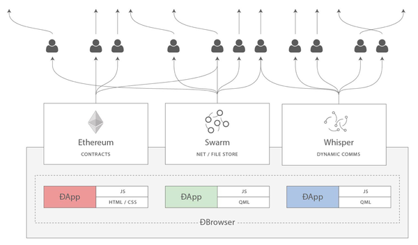

# **用 Go 来做以太坊开发**

本教程是给任何想用 Go 进行以太坊开发的同学一个概括的介绍。本意是如果你已经对以太坊和 Go 有一些熟悉，但是对于怎么把两者结合起来还有些无从下手，那本教程就是一个好的起点。你会学习如何用 Go 与智能合约交互，还有如何完成一些日常的查询和任务。

这本书里有很多我希望我当初学习用 Go 以太坊开发的时候能有的代码范例。你上手 Go 语言以太坊开发的大部分所需知识，本教程里面都会手把手介绍到。

当然了，以太坊还是一直在飞速的发展的进化的。所以难免会有些过期的内容，或者你认为有可以值得提升的地方。请及时与管理员联系。

> 以太坊是一个开源，公开，基于区块链的分布式计算平台和具备智能合约（脚本）功能的操作系统。它通过基于交易的状态转移支持中本聪共识的一个改进算法。

-<u>维基百科</u>

以太坊是一个区块链，允许开发者创建完全去中心化运行的应用程序，这意味着没有单个实体可以将其删除或修改它。部署到以太坊上的每个应用都由以太坊网络上每个完整客户端执行。

#### **Solidity**

Solidity 是一种用于编写智能合约的图灵完备编程语言。Solidity 被编译成以太坊虚拟机可执行的字节码。

#### **go-ethereum**

本教程中，我们将使用 Go 的官方以太坊实现<u>go-ethereum</u>来和以太坊区块链进行交互。Go-ethereum，也被简称为 Geth，是最流行的以太坊客户端。因为它是用 Go 开发的，当使用 Golang 开发应用程序时，Geth 提供了读写区块链的一切功能。

本书的例子在 go-ethereum 版本 `1.8.10-stable` 和 Go 版本 `go1.10.2` 下完成测试。

#### **Block Explorers**

<u>Etherscan</u>是一个用于查看和深入研究区块链上数据的网站。这些类型的网站被称为_区块浏览器_，因为它们允许您查看区块（包含交易）的内容。区块是区块链的基础构成要素。区块包含在已分配的出块时间内开采出的所有交易数据。区块浏览器也允许您查看智能合约执行期间释放的事件以及诸如支付的 gas 和交易的以太币数量等。

### **Swarm and Whisper**

我们还将深入研究蜂群(Swarm)和耳语(Whisper)，分别是一个文件存储协议和一个点对点的消息传递协议，它们是实现完全去中心化和分布式应用程序需要的另外两个核心。

